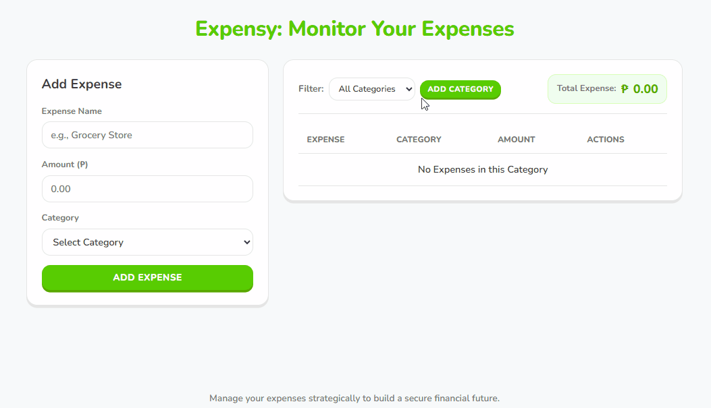

### 💸 Expensy: Monitor Your Expenses

Expensy is a web-based application that helps users track their expenses and manage their budget. It allows users to add, edit, and delete expenses, as well as filter expenses by category. Expensy also provides a summary of total expenses, which is updated in real-time as users add or remove expenses.

## 💻 Demo

 

[Expensy: Monitor Your Expenses](https://cedrexpelagio.github.io/Expensy/) ← Click the link to monitor your expenses

## 🚀 Features

- **Add Expenses**: Users can add expenses with name, amount, and category.
- **Edit Expenses**: Users can edit existing expenses.
- **Delete Expenses**: Users can delete expenses.
- **Filter Expenses**: Users can filter expenses by category.
- **Total Expenses**: Users can view the total expenses.
- **Dynamic Categories**: Users can add new categories.
- **Local Storage**: The application stores expenses in the browser's local storage.
- **Duolingo-style Design**: The application has a modern and user-friendly interface with a duolingo-style design.

## 🛠 Technologies

- HTML
- CSS
- JavaScript

## 🛠 Tools

- GitHub
- Visual Studio Code
- Git
- Antigravity

## 🤳 How to Use

**Adding Expenses**
1. Enter the name and amount of the expense.
2. Select a category.
3. Click the "Add Expense" button.
4. The expense will be added to the list and the total expenses will be updated.

**Updating Expenses**
1. Click the "Update" button on the expense you want to update.
2. The expense will be updated in the list and the total expenses will be updated.

**Deleting Expenses**
1. Click the "Delete" button on the expense you want to delete.
2. The expense will be deleted from the list and the total expenses will be updated.

**Filtering Expenses**
1. Select a category from the filter dropdown.
2. The expenses will be filtered by category.

**Adding Categories**
1. Click the "Add Category" button.
2. Enter the name of the category.
3. Click the "Submit" button.
4. The category will be added to the list and the filter dropdown.

## 👨‍💻 Run Locally

1. Clone the repository
```bash
   git clone https://github.com/cedrexpelagio/Expensy.git
```
2. Navigate to the project folder
```bash
   cd Expensy
```
3. Open `index.html` in your browser (double-click it, or right-click → Open With → your browser)

## 🔮 Future Improvements

**Data Visualization**
- Pie Chart: To visualize the distribution of expenses by category
- Bar Chart: To compare the expenses of different categories

**Date Tracking and Filtering**
- Date Tracking: To track the date of expenses
- Date Filtering: To filter expenses by date
- Weekly and Monthly Expense Summary: To view the expenses of the current week and month

## ⚙ Process

I started by brainstorming the brand design and color palette. Next, I used Antigravity to vibe-code the UI design and layout, drawing inspiration from Duolingo's vibrant style. After establishing the interface, I wrote the JavaScript logic to bring the application's features to life. I used Git for version control and hosted the repository on GitHub. Throughout development, I applied concepts from my previous projects—such as DOM manipulation, event handling, and working with arrays and objects. Along the way, I also implemented Local Storage, a technique I learned from GeeksforGeeks.

## 📝 Learning

Building this project significantly strengthened my understanding of DOM manipulation, event handling, arrays, objects, and other core JavaScript concepts. I gained a clearer understanding of how to properly use the `innerHTML` method to dynamically inject HTML structures. Additionally, I learned how to effectively manipulate arrays of objects for operations like filtering, adding, and deleting data. Handling multiple events gave me better control over interactive webpage elements, and integrating Local Storage taught me how to securely persist user expenses and categories in the browser. Overall, this project was a great way to put everything I've learned from my past projects and The Odin Project curriculum into practice.